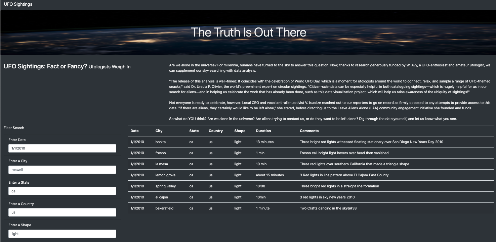

# UFOs

The webpage and dynamic table are able to capture a more in-depth analysis of UFO sightings by accepting multiple criteria as filters. Users can input the following for filter search: date, city, state, country, shape.

 
Reference: [MDN Web Docs](https://developer.mozilla.org/en-US/docs/Web/JavaScript/Reference/Global_Objects/Array/filter)
 

## Overview of Project: 
##### Explain the purpose of this analysis.

The website allows users to input multiple filters at the same time. The dynamic table will auto-generate relevent data based on the input criterias.

## Results:
##### Describe to Dana how someone might use the new webpage by walking her through the proces of using the search criteria. Use images of your webpage during the filtering process to support your explanation.

Based on what users want to filter, enter in the filter box with information in correct format. Please note that it is important to follow the format in order for the table to capture data correctly. For instance, if users would like to get UFO sightings on 1/1/2010, at California, US, and the shape of light. 

In this case, filter search would look like the followings:

- Enter Date: 1/1/2010
- Enter a City: (blank)
- Enter a State: ca
- Enter a Country: us
- Enter a Shape: light

## Summary:
##### In a summary statement, describe one drawback of this new design and two recommendations for further development. 

One of the drawbacks of this new design would be that the dynamic table lacks the ability to show data in sorted order (For example, duration.) The first recommendation I would provide is to add another division at the bottom of \<body/> to show where the entire data source come from. The second recommendation would be to add feature to sort the data that is generated by the dynamic table.